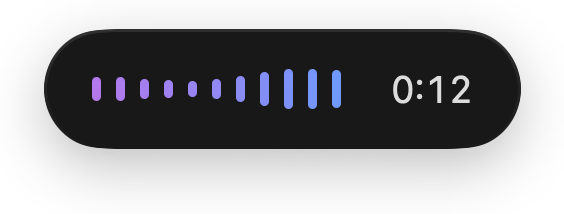
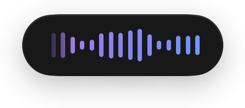
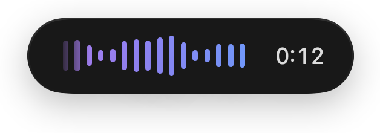
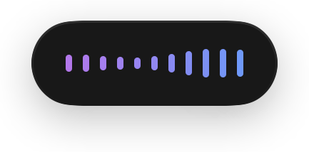
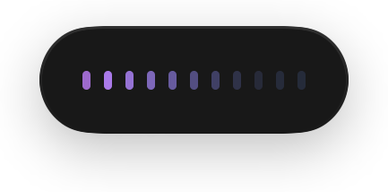
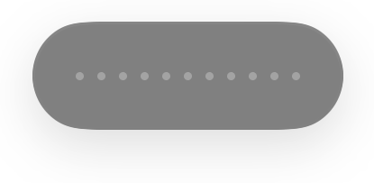

<p align="center">
  
</p>

<h1 align="center">
  Pegel<br>
  <sub>A very simple and fast transcription app for macOS.</sub>
</h1>

<p align="center">
  
  
  
  <a href="https://buymeacoffee.com/hazematic"></a>
</p>

<p align="center">
  
</p>

## What it does

Pegel does one thing. You press a shortcut, you speak, and the words appear at the
cursor in whatever app you are already in. Nothing to manage, nothing to sign into, and
the audio never leaves the machine.

## Why it is simple

I tried a lot of dictation apps. Most were either too slow, others were fast but not 
accurate enough, so you had to constantly correct them manually.
The rest buried the one thing I wanted in a bundle with a subscription.

Simple here means Pegel has one job and does it reliably. No history, no dictionary
manager, no per-app profiles, no account. I mostly dictate instructions for AI agents,
where one spoken sentence saves a typed paragraph, and for that the only thing that
matters is that it works every single time.

Simple also means one model instead of a picker. I tested a handful and settled on
NVIDIA Parakeet TDT 0.6B v3. It is quick enough that dictating beats typing, it fits on
the Neural Engine, and I am not correcting every other line. It covers 25 European
languages and keeps up when a sentence switches between them, which is where some of
the others produced nonsense. So there is nothing to choose in the settings, the choice
is made.

## Requirements

- macOS 14 or later
- Apple Silicon. The model runs on the Neural Engine; Intel Macs are not supported.
- 461 MB of disk space for the model, downloaded on first launch. macOS adds a Core ML
  cache on top when it compiles the model for the Neural Engine; that one is a few tens
  of MB after a clean run and grows as new versions of the app are installed.

## Install

### Homebrew

```bash
brew install --cask hazematic/tap/pegel
```

That is the whole installation: the cask clears the quarantine flag for you, which you
would otherwise have to do by hand because the app is not notarised. `brew upgrade`
picks up new versions, and `brew uninstall --zap --cask pegel` removes the app together
with its settings and the downloaded model.

### Build it yourself

```bash
git clone https://github.com/hazematic/pegel.git
cd pegel
./build-app.sh release --install
```

This needs the Xcode Command Line Tools (`xcode-select --install`). The script builds
the app, signs it locally, copies it to `/Applications` and launches it. Apps you build
yourself are not quarantined, so macOS starts them without complaint. Xcode itself is
not required, but it can open `Package.swift` directly.

Without a certificate of your own the app is signed ad hoc, which works but makes macOS
treat every rebuild as a different app and ask for the permissions again. A self-signed
certificate fixes that: Keychain Access, Certificate Assistant, *Create a Certificate*,
type *Code Signing*, named `Pegel Local`. The build script picks it up on its own.

### Use the prebuilt app

Download the ZIP from [Releases](../../releases), move `Pegel.app` to `/Applications`
and clear the quarantine flag once:

```bash
xattr -dr com.apple.quarantine /Applications/Pegel.app
```

The alternative is System Settings > Privacy & Security, scroll down to Security and
press Open Anyway after the failed launch. The old trick of right-clicking the app and
choosing Open no longer works, it was removed in macOS Sequoia. The flag is set by
whatever the app arrived through, so a copy over a USB stick or a network share never
carries it and none of this applies.

## First launch

The model is not part of the app, and Pegel does not fetch it behind your back: a
window explains the one-off download of 461 MB and nothing happens until you press the
button. Progress and the three permissions then run side by side, a failed download can
be retried where it left off, and the last page shows the shortcut you will be using.
That download is the only time Pegel touches the network.

## Uninstall

The model and the Core ML cache live outside the bundle, so the Trash leaves half a
gigabyte and up behind. Through Homebrew it is `brew uninstall --zap --cask pegel`,
otherwise `./uninstall.sh` from this repository, which lists what it will remove and
asks first. Only the script also clears the three entries under Privacy & Security.

## Permissions and why they are needed

Pegel asks for three permissions. Two of them are the ones a keylogger would ask for,
so here is exactly what each is used for.

| Permission       | Used for                                                                                                                              |
| ---------------- | ------------------------------------------------------------------------------------------------------------------------------------- |
| Microphone       | Recording your dictation.                                                                                                             |
| Input Monitoring | Seeing the keyboard shortcut while another app is in front. This is the only reason keyboard events are read at all.                  |
| Accessibility    | Pasting the finished text at the cursor, and reading the single character in front of the cursor to decide whether a space is needed. |

Nothing is logged, stored or transmitted. Audio is held in memory for the length of one
dictation and discarded afterwards. The parts worth reading are
`Input/HotkeyMonitor.swift` for the keyboard and `Input/TextInjector.swift` for the
pasting. Pegel runs without the App Sandbox, since a global event tap and pasting into
other applications do not work inside it.

Input Monitoring is a separate item in System Settings and is needed on top of
Accessibility; if it is missing, the Accessibility switch looks right and nothing
happens anyway. If every switch is on and the shortcut stays dead, the cause is usually
a stale entry from an earlier build:

```bash
tccutil reset All io.github.hazematic.pegel
```

## Using it

| Action | Result |
|---|---|
| Press the shortcut briefly | Recording runs until you press again |
| Hold the shortcut | Push to talk, releasing ends the recording |
| Esc while recording | Recording is discarded, nothing is inserted |

The default shortcut is `⌥Space`. The space bar sits in the same place on ANSI, ISO and
JIS keyboards, and `⌥Space` is not a system shortcut on macOS: `⌘Space` belongs to
Spotlight, `⌃Space` and `⌃⌥Space` to input source switching, `⌘⌥Space` to the Finder
search window. If you use Alfred you will want to rebind, since `⌥Space` is its default.

It can be changed in the settings, along with the hold threshold and the appearance of
the pill. There are two waveforms, and the elapsed time can be switched off, which makes
the pill narrower.

| | Blank | With elapsed time |
|---|---|---|
| **Levels**<br>the present moment, default |  |  |
| **Trail**<br>the last two seconds |  |  |

While recording, the pill sits at the bottom of the screen and follows the microphone
level, so you can see that sound is actually arriving. You can drag it anywhere and it
stays there.

| State | | |
|---|---|---|
| **Recording** | height follows the microphone level |  |
| **Transcribing** | same height, a light runs through |  |
| **Discarded** | escape, nothing is inserted |  |
| **Error** | flashes twice, then stands |  |

Between two dictations Pegel inserts a space by itself when there is already text in
front of the cursor. The character before the cursor is read from the actual text
through the Accessibility API rather than inferred from what was inserted last, so the
spacing is still right if you typed something or moved the cursor in between.

## How fast

Pegel transcribes after you stop speaking rather than while you speak, which avoids the
visible self corrections of streaming recognition. Measured on a 16 inch MacBook Pro
from 2021 with M1 Pro and 16 GB:

| Dictation | Time until the text appears |
|---|---|
| 3 seconds | 0.17 s |
| 71 seconds | 0.72 s |

Roughly 0.15 s fixed cost per dictation, everything beyond that at about 125 times
realtime. Newer hardware is faster; the published benchmarks for this model were
measured on an M4 Pro. Idle cost is 0 % CPU and about 36 MB of memory.

## Project layout

| File | Job |
|---|---|
| `Core/RecordingController.swift` | State machine, ties everything together |
| `Core/TranscriptionService.swift` | Loading, warming up and running Parakeet |
| `Input/HotkeyMonitor.swift` | Event tap, toggle, push to talk, escape |
| `Input/TextInjector.swift` | Pasting through the clipboard, then restoring it |
| `UI/IndicatorView.swift` | The waveforms in the pill, all states and curves |

The pills above are not mockups, they are rendered from the same code the app runs and
cannot drift from the real thing:

```bash
build/Pegel.app/Contents/MacOS/Pegel --export-icons /tmp/pegel-preview
```

That writes them, the icon set and the menu bar previews.

## Built with

- [FluidAudio](https://github.com/FluidInference/FluidAudio) for the Core ML runtime,
  Apache 2.0
- [Parakeet TDT 0.6B v3](https://huggingface.co/FluidInference/parakeet-tdt-0.6b-v3-coreml)
  by NVIDIA, converted by FluidInference, CC-BY-4.0

Pegel passes German to the model as a language hint. That only narrows the candidates
to Latin script, so the other Latin-script languages are unaffected; Greek or Cyrillic
would need the hint changed.

## Licence

MIT. See [LICENSE](LICENSE) and [NOTICE](NOTICE).

---

<p align="center">
  If Pegel saves you time, you can buy me a coffee.
</p>

<p align="center">
  <a href="https://buymeacoffee.com/hazematic"></a>
</p>
