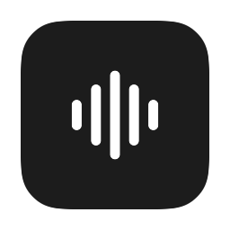
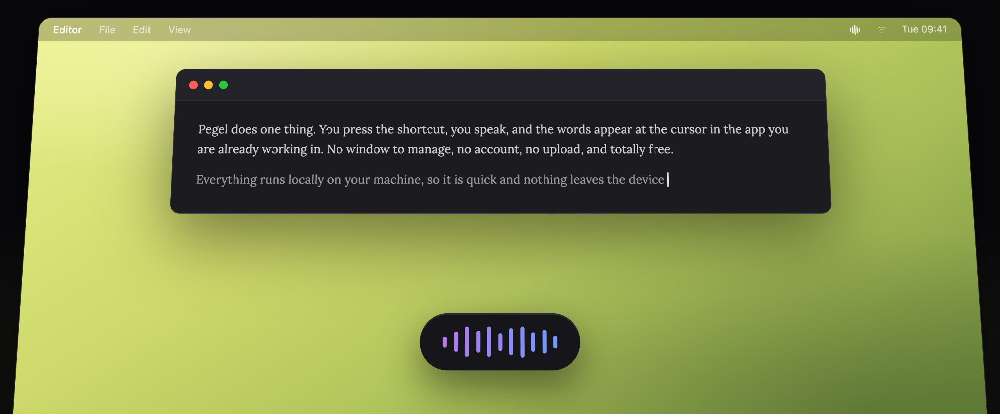
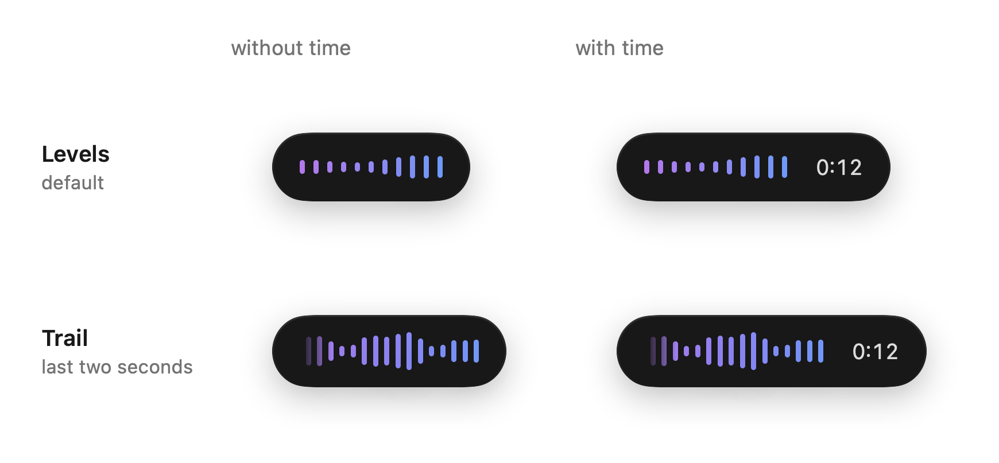
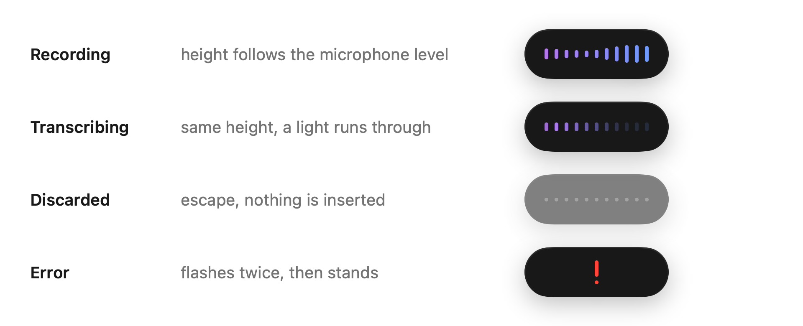

<p align="center">
  
</p>

<h1 align="center">
  Pegel<br>
  <sub>A very simple and fast transcription app for macOS.</sub>
</h1>

<p align="center">
  
  
  
</p>

<p align="center">
  
</p>

## What it does

Pegel does one thing. You press a shortcut, you speak, and the words appear at the
cursor in whatever app you are already working in. There is no window to manage, no
account, and no upload.

Recognition runs on your Mac, on the Neural Engine, using NVIDIA Parakeet TDT 0.6B v3.
After the model has been downloaded once, Pegel works without a network connection.

Parakeet covers 25 European languages. It is particularly good at the case that comes
up constantly in practice and that trips up many other models: English technical terms
dropped into a sentence in another language.

## Why another dictation app

There are a lot of them. I tried a great many and kept hitting the same walls. Too
slow, so that typing was quicker after all. Not accurate enough, especially on
technical vocabulary. Or the one thing I wanted was buried under features I never asked
for, and I was supposed to pay a subscription for the whole bundle.

What I needed was one thing only: speak, get text, at the cursor, fast enough that
dictating beats typing. Mostly to write instructions for AI agents, where one spoken
sentence saves a typed paragraph.

After testing a number of models, Parakeet turned out to be the sweet spot. Fast enough
to feel immediate, small enough to run locally, and accurate enough that you are not
correcting every second line. It also handles mixed language input, which is where
several other models produced nonsense.

Pegel does that one thing and nothing else.

## Requirements

- macOS 14 or later
- Apple Silicon. The model runs on the Neural Engine; Intel Macs are not supported.
- About 1.7 GB of disk space: 461 MB for the model, downloaded on first launch, plus
  roughly 1.2 GB of Core ML cache that macOS builds when it compiles the model for the
  Neural Engine.

## Install

### Homebrew

```bash
brew install --cask hazematic/tap/pegel
```

That is the whole installation: the cask clears the quarantine flag for you, which
you would otherwise have to do by hand because the app is not notarised.
`brew upgrade` picks up new versions, and `brew uninstall --zap --cask pegel` removes
the app together with its settings and the downloaded model.

### Build it yourself

```bash
git clone https://github.com/hazematic/pegel.git
cd pegel
./build-app.sh release --install
```

This needs the Xcode Command Line Tools (`xcode-select --install`). The script builds
the app, signs it locally, copies it to `/Applications` and launches it. Apps you build
yourself are not quarantined, so macOS starts them without complaint. Xcode itself is
not required, but it can open `Package.swift` directly.

Without a certificate of your own the app is signed ad hoc, which works but makes macOS
treat every rebuild as a different app and ask for the permissions again. A
self-signed certificate fixes that:

1. Keychain Access, Certificate Assistant, *Create a Certificate*
2. Type *Code Signing*, self-signed, named `Pegel Local`
3. `./build-app.sh release` picks it up automatically

### Use the prebuilt app

Download the ZIP from [Releases](../../releases) and move `Pegel.app` to
`/Applications`. Because the app is not notarised by Apple, macOS will refuse the first
launch. Clear the quarantine flag once:

```bash
xattr -dr com.apple.quarantine /Applications/Pegel.app
```

The alternative is System Settings > Privacy & Security, scroll down to Security and
press Open Anyway after the failed launch. The old trick of right-clicking the app and
choosing Open no longer works; it was removed in macOS Sequoia.

The quarantine flag is set by whatever the app arrived through, not by the archive. A
copy over a USB stick, a network share or `scp` never carries it, and then Pegel starts
without any of this.

## First launch

The speech model is not part of the app. On first launch Pegel does not fetch it on its
own: a window explains the one-off download of 461 MB and nothing happens until you
press the button. From there the progress and the three permissions run side by side,
and the last page shows the shortcut you will be using.

If the download fails there is a retry that picks up where it left off. This is the
only time Pegel touches the network. The model lands in
`~/Library/Application Support/FluidAudio/Models/`.

## Uninstall

Dragging the app to the Trash leaves about 1.7 GB behind, because the model and the
Core ML cache live outside the bundle. If you installed through Homebrew:

```bash
brew uninstall --zap --cask pegel
```

Otherwise run the script in this repository, which lists what it is about to remove and
asks before it does:

```bash
./uninstall.sh
```

Either way the three entries under Privacy & Security remain as leftovers; the script
clears them with `tccutil`, Homebrew does not.

## Permissions and why they are needed

Pegel asks for three permissions. Two of them are the ones a keylogger would ask for,
so here is exactly what each is used for.

| Permission       | Used for                                                                                                                              |
| ---------------- | ------------------------------------------------------------------------------------------------------------------------------------- |
| Microphone       | Recording your dictation.                                                                                                             |
| Input Monitoring | Seeing the keyboard shortcut while another app is in front. This is the only reason keyboard events are read at all.                  |
| Accessibility    | Pasting the finished text at the cursor, and reading the single character in front of the cursor to decide whether a space is needed. |

Nothing is logged, stored or transmitted. Audio is held in memory for the length of one
dictation and discarded afterwards. The source is here; the parts worth checking are
`Input/HotkeyMonitor.swift` for the keyboard and `Input/TextInjector.swift` for the
pasting.

Input Monitoring is a separate item in System Settings and is needed in addition to
Accessibility. If it is missing, the Accessibility switch looks correct and still
nothing happens. If every switch is on and the shortcut stays dead, the usual cause is
a stale entry from an earlier build with a different signature:

```bash
tccutil reset Accessibility io.github.hazematic.pegel
tccutil reset ListenEvent io.github.hazematic.pegel
tccutil reset Microphone io.github.hazematic.pegel
```

Pegel deliberately runs without the App Sandbox. A global event tap and pasting into
other applications do not work inside it.

## Using it

| Action | Result |
|---|---|
| Press the shortcut briefly | Recording runs until you press again |
| Hold the shortcut | Push to talk, releasing ends the recording |
| Esc while recording | Recording is discarded, nothing is inserted |

The default shortcut is `⌥Space`. The space bar sits in the same place on ANSI, ISO and
JIS keyboards, and `⌥Space` is not a system shortcut on macOS: `⌘Space` belongs to
Spotlight, `⌃Space` and `⌃⌥Space` to input source switching, `⌘⌥Space` to the Finder
search window. If you use Alfred you will want to rebind, since `⌥Space` is its default.

It can be changed in the settings, along with the hold threshold and the appearance of
the pill. There are two waveforms: bars showing the present moment, or a trail of the
last two seconds. The elapsed time can be switched off, which makes the pill narrower.

<p align="center">
  <picture>
    <source media="(prefers-color-scheme: dark)" srcset="assets/variants-dark.png">
    
  </picture>
</p>

While recording, a small dark pill appears at the bottom of the screen showing the
microphone level, so you can see that sound is actually arriving. You can drag it
anywhere and it stays there.

<p align="center">
  <picture>
    <source media="(prefers-color-scheme: dark)" srcset="assets/states-dark.png">
    
  </picture>
</p>

Between two dictations Pegel inserts a space by itself when there is already text in
front of the cursor. The character before the cursor is read from the actual text
through the Accessibility API rather than inferred from what was inserted last, so the
spacing is still right if you typed something or moved the cursor in between.

## How fast

Pegel transcribes after you stop speaking rather than while you speak, which avoids the
visible self corrections of streaming recognition. The wait is short enough that it does
not register as waiting.

Measured on the machine this was built on, a 16 inch MacBook Pro from 2021 with M1 Pro
and 16 GB:

| Dictation | Time until the text appears |
|---|---|
| 3 seconds | 0.17 s |
| 71 seconds | 0.72 s |

There is a fixed cost of roughly 0.15 s per dictation; everything beyond that is
processed at about 125 times realtime. A dictation of half a minute is therefore ready
in well under half a second. Newer hardware is faster: the published benchmarks for this
model were measured on an M4 Pro.

Idle cost is 0 % CPU and about 36 MB of memory.

## Privacy

Everything happens on your Mac. There is no account, no telemetry, no crash reporting
and no network traffic at all after the initial model download.

## Limitations

- Apple Silicon only.
- Recognition is tuned for German and English. Other European languages are covered by
  the model but untested here.
- The app is not notarised, see Install.

## Project layout

| File | Job |
|---|---|
| `Core/RecordingController.swift` | State machine, ties everything together |
| `Core/AudioCapture.swift` | Microphone capture, level, length limit |
| `Core/TranscriptionService.swift` | Loading, warming up and running Parakeet v3 |
| `Input/HotkeyMonitor.swift` | Event tap, toggle, push to talk, escape |
| `Input/HotkeyBinding.swift` | Shortcut, persistence, keyboard layout resolution |
| `Input/CaretTracker.swift` | Cursor position with its fallback chain |
| `Input/TextInjector.swift` | Pasting through the clipboard, then restoring it |
| `UI/SetupView.swift` | First launch: model download and permissions |
| `uninstall.sh` | Removes the app, the model and the Core ML cache |
| `UI/Mark.swift` | The mark, one source for menu bar and app icon |
| `UI/IndicatorView.swift` | The waveforms in the pill, all states and curves |
| `UI/IndicatorPanel.swift` | Non-activating window at the bottom, draggable |

The figures above are not mockups. They are rendered from the same code the app runs,
so they cannot drift from the real thing:

```bash
build/Pegel.app/Contents/MacOS/Pegel --export-icons /tmp/pegel-preview
```

That writes the icon set, menu bar previews at 16, 18 and 32 pt, and under `indikator/`
every state of the pill in light and dark with the motion frozen.

## Built with

- [FluidAudio](https://github.com/FluidInference/FluidAudio) for the Core ML runtime,
  Apache 2.0
- [Parakeet TDT 0.6B v3](https://huggingface.co/FluidInference/parakeet-tdt-0.6b-v3-coreml)
  by NVIDIA, converted by FluidInference, CC-BY-4.0

## Licence

MIT. See [LICENSE](LICENSE) and [NOTICE](NOTICE).
