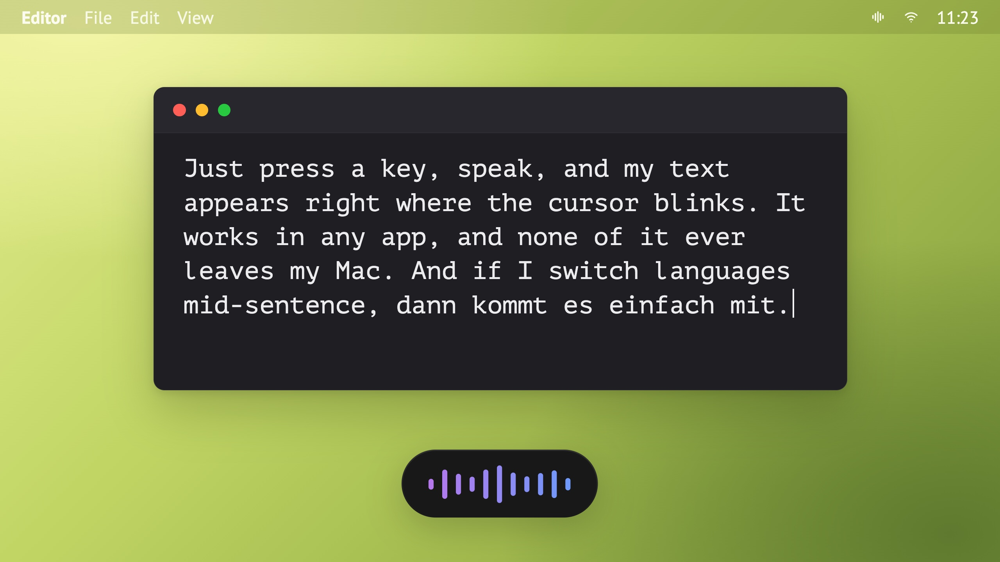
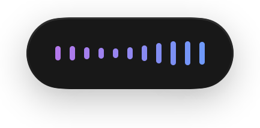
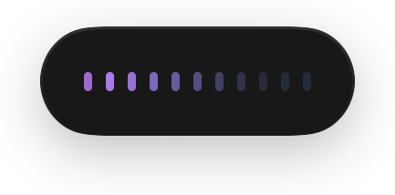
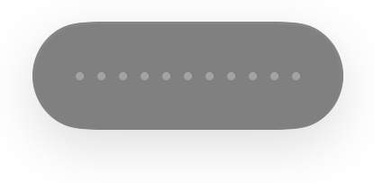
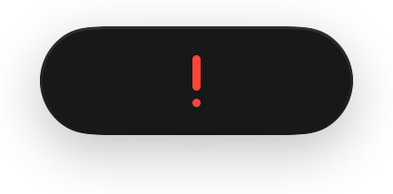

<p align="center">
  
</p>

<h1 align="center">
  Pegel<br>
  <sub>A very simple and fast transcription app for macOS.</sub>
</h1>

<p align="center">
  
  
  
  <a href="https://buymeacoffee.com/hazematic"></a>
</p>

<p align="center">
  
</p>

## What it does

Pegel does one thing: it turns speech into text. You press a shortcut, you speak, and
the words appear at the cursor in whatever app you are already in. A recording or a
video you already have goes through the same model and lands on the clipboard. Nothing
to manage, nothing to sign into, and the audio never leaves the machine.

## Why it is simple

I tried a lot of dictation apps. Most were either too slow, others were fast but not 
accurate enough, so you had to constantly correct them manually.
The rest buried the one thing I wanted in a bundle with a subscription.

Simple here means Pegel has one job and does it reliably. No history, no dictionary
manager, no per-app profiles, no account. I mostly dictate instructions for AI agents,
where one spoken sentence saves a typed paragraph, and for that the only thing that
matters is that it works every single time.

Simple also means one model instead of a picker. I tested a handful and settled on
NVIDIA Parakeet TDT 0.6B v3. It is quick enough that dictating beats typing, it fits on
the Neural Engine, and I am not correcting every other line. It covers 25 European
languages and keeps up when a sentence switches between them, which is where some of
the others produced nonsense. So there is nothing to choose in the settings, the choice
is made.

## Requirements

- macOS 14 or later
- Apple Silicon. The model runs on the Neural Engine; Intel Macs are not supported.
- 461 MB for the model, downloaded on first launch, plus the Core ML cache macOS creates
  when it compiles the model.

## Install

### Homebrew

```bash
brew install --cask hazematic/tap/pegel
```

The cask clears the quarantine flag, which you would otherwise have to do by hand
because the app is not notarised.

### Prebuilt app

Download [Pegel.dmg](../../releases/latest/download/Pegel.dmg), open it and drag Pegel to
Applications. Because the app is not notarised, macOS refuses the first launch. Clear
the quarantine flag once:

```bash
xattr -dr com.apple.quarantine /Applications/Pegel.app
```

Or press *Open Anyway* under System Settings > Privacy & Security after the failed
launch. Right-click and Open no longer works since macOS Sequoia.

### Build it yourself

```bash
git clone https://github.com/hazematic/pegel.git
cd pegel
./build-app.sh release --install
```

This needs the Xcode Command Line Tools (`xcode-select --install`) and builds, signs,
installs and launches the app. Without a certificate of your own it is signed ad hoc,
and macOS asks for the permissions again after every rebuild. A self-signed *Code
Signing* certificate named `Pegel Local`, made in Keychain Access, fixes that; the
script picks it up on its own.

## First launch

A window explains the one-off download of the model and waits until you press the
button. The permissions are granted alongside, and a failed download resumes where it
stopped.

## Using it

| Action | Result |
|---|---|
| Press the shortcut briefly | Recording runs until you press again |
| Hold the shortcut | Push to talk, releasing ends the recording |
| Esc while recording | Recording is discarded, nothing is inserted |

The default shortcut is `⌥Space`, which macOS does not use. If you use Alfred, which
has the same default, change it in the settings. That is also where you pick the
microphone, the start and stop tones, the waveform and the colours.

While recording, the level meter at the bottom of the screen follows the microphone
level, so you can see that sound is arriving. You can drag it anywhere.

| State | | |
|---|---|---|
| **Recording** | height follows the microphone level |  |
| **Transcribing** | same height, a light runs through |  |
| **Discarded** | escape, nothing is inserted |  |
| **Error** | flashes twice, then stands |  |

When there is already text in front of the cursor, Pegel adds a space by itself.
*Transcribe Audio or Video File…* in the menu puts the text of a file on the clipboard.
It reads M4A, MP3, WAV, AIFF, CAF, FLAC and AAC, the sound of MP4 and MOV videos, and
from macOS 15.4 also Ogg and Opus.

The interface is in all 25 languages the model recognises: English and German, and
machine-translated into Bulgarian, Croatian, Czech, Danish, Dutch, Estonian, Finnish,
French, Greek, Hungarian, Italian, Latvian, Lithuanian, Maltese, Polish, Portuguese,
Romanian, Russian, Slovak, Slovenian, Spanish, Swedish and Ukrainian; mistakes can be
reported through the [translation form](../../issues/new?template=translation.yml).
macOS itself has no Bulgarian, Estonian, Latvian, Lithuanian or Maltese interface: add
the language to the preferred languages, or choose it for Pegel alone under Language &
Region › Applications.

## How fast

Pegel transcribes after you stop speaking rather than while you speak, which avoids the
visible self corrections of streaming recognition. Measured on a 2020 MacBook Pro with
M1 and 16 GB, the first generation of Apple silicon:

| Dictation | Time until the text appears |
|---|---|
| 3 seconds | 0.13 s |
| 90 seconds | 1.27 s |

Idle, Pegel uses 0 % CPU and about 68 MB of memory.

## Privacy

Audio and text never leave the Mac. There is no analytics, no crash reporting and no
account. Pegel goes online in two cases, both started by you:

- **Model download**, once, after you press the button. The files come from Hugging
  Face, which sees your IP address.
- **Update check**, only through *Check for Updates…* in *About Pegel…* or the automatic
  check you can switch on there. Pegel fetches `appcast.xml` from GitHub and, if there
  is a new version, the ZIP from the release. GitHub sees your IP address and the Pegel
  and macOS versions. Updates run through [Sparkle](https://sparkle-project.org) and are
  only installed if they carry the project's signature and the same certificate, so
  the permissions you granted survive.

## Permissions

Two of the three permissions are the ones a keylogger would ask for, so here is exactly
what each is used for.

| Permission | Used for |
|---|---|
| Microphone | Recording your dictation. |
| Input Monitoring | Seeing the shortcut while another app is in front. This is the only reason keyboard events are read at all. |
| Accessibility | Pasting the text at the cursor, and reading the character in front of it to decide whether a space is needed. |

Nothing is logged or stored, audio is held in memory for one dictation. The parts worth
reading are `Input/HotkeyMonitor.swift` and `Input/TextInjector.swift`. Pegel runs
without the App Sandbox, since a global event tap and pasting into other apps do not
work inside it.

If every switch is on and the shortcut stays dead, Input Monitoring is missing or an
entry from an earlier build is stale:

```bash
tccutil reset All io.github.hazematic.pegel
```

## Uninstall

Model and cache live outside the app, so the Trash leaves half a gigabyte behind. Use
`brew uninstall --zap --cask pegel` or `./uninstall.sh` from this repository, which
asks first and also clears the entries under Privacy & Security.

## Project layout

| File | Job |
|---|---|
| `Core/RecordingController.swift` | State machine, ties everything together |
| `Core/TranscriptionService.swift` | Loading, warming up and running Parakeet |
| `Input/HotkeyMonitor.swift` | Event tap, toggle, push to talk, escape |
| `Input/TextInjector.swift` | Pasting through the clipboard, then restoring it |
| `Input/CaretTracker.swift` | Text before the cursor, screen of the cursor |
| `UI/IndicatorView.swift` | The level meter, all states and curves |

The images above are rendered from the same code the app runs:
`Pegel --export-icons <folder>`.

## Built with

- [FluidAudio](https://github.com/FluidInference/FluidAudio) for the Core ML runtime,
  Apache 2.0
- [Parakeet TDT 0.6B v3](https://huggingface.co/FluidInference/parakeet-tdt-0.6b-v3-coreml)
  by NVIDIA, converted by FluidInference, CC-BY-4.0

## Licence

MIT. See [LICENSE](LICENSE) and [NOTICE](NOTICE).

Apple, Mac, macOS and Apple silicon are trademarks of Apple Inc., registered in the U.S.
and other countries. Pegel is an independent project and is not affiliated with Apple.

---

<p align="center">
  If Pegel saves you time, you can buy me a coffee.
</p>

<p align="center">
  <a href="https://buymeacoffee.com/hazematic"></a>
</p>
